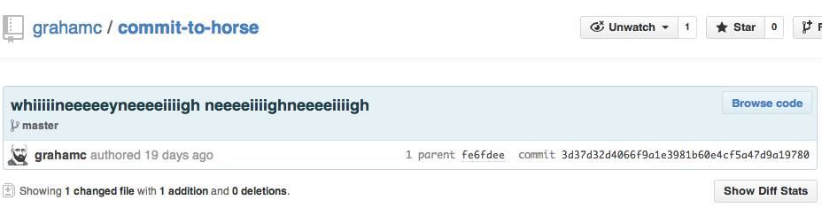
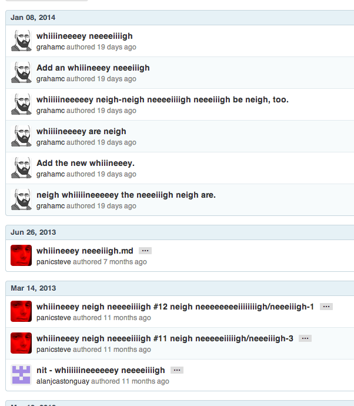

commit-to-horse
===============

[Direct download of crx file][1]

Chrome extension that replaces commit messages with whinneying and horsing
around.

Note, if you add #nohorse to a URL, it stops getting horsey.

Examples
--------

Installation
------------

In Chrome, choose Window > Extensions.  Drag CommitToHorse.crx into the page that appears.

[1]: https://github.com/grahamc/commit-to-horse/raw/master/CommitToHorse.crx
